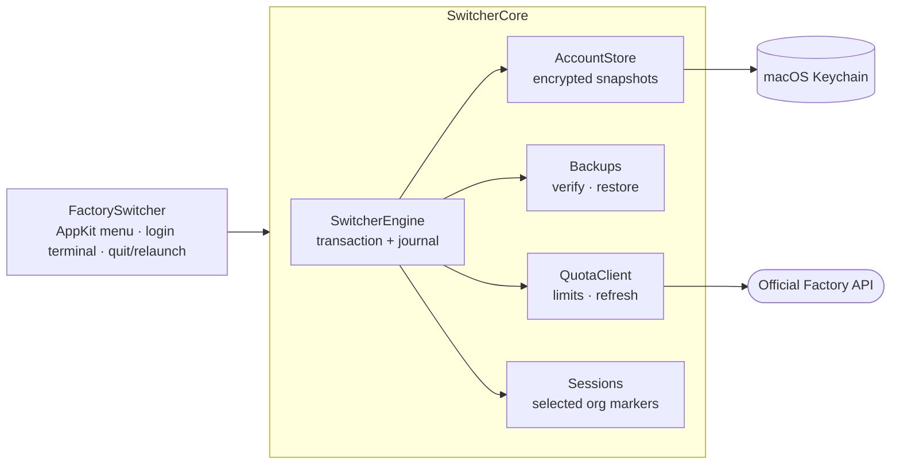

<div align="center">


<p>
  <a href="https://github.com/lhfer/factory-switcher/releases/latest"></a>
  <a href="https://github.com/lhfer/factory-switcher/actions/workflows/ci.yml"></a>
  
  
  
  <a href="LICENSE"></a>
</p>

**English** · [简体中文](README.zh-CN.md)

<h3>Your work account, your personal account, your side-project org —<br>one click apart, right from the menu bar.</h3>

<p><a href="#-install"><b>Download</b></a> · <a href="#-quick-start"><b>Quick start</b></a> · <a href="#-how-a-switch-stays-safe"><b>How it works</b></a> · <a href="#-faq"><b>FAQ</b></a></p>

</div>

> [!IMPORTANT]
> **Unofficial, community-built tool.** It is not affiliated with or endorsed by Factory.
> It only manages accounts **you** signed into through Factory's official login, it **never switches automatically**,
> and it does not touch server-side quotas, billing or organization permissions. Use it in line with Factory's
> terms and your organization's policies.

## ✨ Why

If you use [Factory](https://factory.ai) Droid with more than one account — say a company org and a personal one —
switching normally means signing out, going through the browser OAuth again and hoping you picked the right
profile. **Factory Switcher** keeps an encrypted snapshot of each login you already have and swaps them for you,
safely, from a tiny `FS` icon in the menu bar.

<div align="center">
  
</div>

## 🧰 Features

| | Feature | What you get |
|:-:|---|---|
| 🔁 | **One-click switching** | Pick a saved account → Factory quits gracefully, the login is swapped, Factory reopens. |
| 📊 | **Quota at a glance** | 5-hour, weekly and monthly *remaining %* for every account, plus reset times and extra-usage balance when the official API provides them. Refreshes every 5 min (optional). |
| 🔑 | **Official login only** | New accounts are added through the Droid CLI bundled inside your Factory.app, in an isolated home. Browser authorization stays 100% official. |
| 🛡️ | **Backup first, roll back on failure** | Every switch is backed up and verified *before* anything changes. Any failure restores the original login; interrupted runs can be recovered from the menu. |
| 🔐 | **Encrypted at rest** | Login snapshots are AES-GCM encrypted; keys live in the macOS Keychain, never next to the files. Tokens are never printed or logged. |
| 💬 | **Carry chosen sessions across accounts** *(opt-in)* | Pick specific local conversations to continue under another account. Backed up first; untouched unless you select them. |
| 🪶 | **Tiny & native** | Swift + AppKit, ~1 MB, zero third-party dependencies, no telemetry, no Dock icon. |

## 🧭 How a switch stays safe

<div align="center">
  
</div>

1. **Confirm** — you see the target account and a reminder that running tasks will stop (can be turned off in Settings).
2. **Quit gracefully** — Factory is asked to quit normally. Running terminal `droid` sessions block the switch; nothing is ever force-killed.
3. **Back up & verify** — the latest (possibly just-rotated) tokens of the current account are saved, then a backup is written and checked.
4. **Swap login** — the target's encrypted login and key are installed and verified.
5. **Relaunch** — Factory reopens as the new account. If any step fails, the original login and session markers are restored.

## 📦 Install

### Option A — Download (Apple Silicon)

1. Grab `FactorySwitcher-*-arm64.zip` from the [**latest release**](https://github.com/lhfer/factory-switcher/releases/latest) and unzip it.
2. Move `FactorySwitcher.app` to a stable place, e.g. `~/Applications`.
3. Open it. Because the build is **ad-hoc signed and not notarized**, macOS will block the first launch:
   go to **System Settings → Privacy & Security**, scroll down and click **Open Anyway**.
4. On first use macOS may ask for Keychain access. Allow it only for the switcher you trust.

> [!NOTE]
> Please don't disable Gatekeeper or strip security attributes to run it. If you'd rather not trust a downloaded
> binary, building from source takes about a minute.

### Option B — Build from source

Requires macOS 13+ and Xcode 16 / Swift 6 command-line tools.

```bash
git clone https://github.com/lhfer/factory-switcher.git
cd factory-switcher
swift test
bash scripts/build-app.sh   # → dist/FactorySwitcher.app
```

## 🚀 Quick start

1. Launch the app — an **FS** item appears in the menu bar (no Dock icon, no window).
2. **保存 / 同步当前账号** *(Save / sync current account)* — snapshots the account you're signed into now. Factory keeps running.
3. **添加账号（官方登录）…** *(Add account — official login)* — give it a label; a Terminal opens running Factory's own Droid in an isolated home. Authorize in the browser (tip: use a private window if it auto-signs you into the old account).
4. When it says you're logged in, quit Droid in that terminal with **Ctrl+C** — *not* `/logout`. The new account is saved automatically.
5. Click any saved account to switch. After Factory reopens, double-check the email/org shown in Factory before starting work.

> [!WARNING]
> **Switching quits and reopens Factory — running tasks will be interrupted.** Finish or save your work first, and
> close any `droid` sessions in your terminals.

> [!NOTE]
> The app's interface is currently **Simplified Chinese only**. English labels above are translations of the menu items.
> The full user guide (Chinese) is in [`docs/USAGE.zh-CN.md`](docs/USAGE.zh-CN.md) and also opens from the menu.

## 🔒 Privacy & local data

Network access is limited to the official login you start, the official billing-limits endpoint and, for idle
accounts, the official token refresh. No analytics, no telemetry, no uploads of your backups.

| What | Where |
|---|---|
| Labels, emails, user/org IDs, preferences | `~/.factory-switcher/state.json` |
| Encrypted login snapshots | `~/.factory-switcher/accounts/` |
| Login backups, selected session copies, recovery journal | `~/.factory-switcher/backups/` |
| Isolated homes for official logins | `~/.factory-switcher/logins/` |
| Snapshot & backup encryption keys | macOS Keychain, service `local.FactorySwitcher.keys` |

Sensitive folders are `0700`, files `0600`. **Session backups contain full conversation text and are not separately
encrypted**, and labels/emails are plain metadata — they rely on file permissions. Turning on FileVault is recommended,
and don't put `~/.factory-switcher` in a cloud-synced folder.

## ❓ FAQ

<details>
<summary><b>Does this give me more quota or bypass limits?</b></summary>

No. It shows the official quota of each account you already own and lets you switch between them by hand. It never
switches automatically, never creates accounts and never modifies quotas, billing or org settings. Use multiple
accounts only where Factory's terms and your organization allow it.
</details>

<details>
<summary><b>The browser signs me into the old account when adding a new one.</b></summary>

That's your browser's existing session, not the switcher. Copy the authorization link Droid prints into a private /
incognito window and sign in with the account you want to add.
</details>

<details>
<summary><b>Will my running agent survive a switch?</b></summary>

No — a switch quits and relaunches Factory. The switcher refuses to proceed while terminal `droid` processes are
running and never force-kills anything, but anything running inside Factory will stop.
</details>

<details>
<summary><b>Can I continue a conversation from account A under account B?</b></summary>

Only conversations you explicitly select. The switcher backs them up and removes the org marker from their first line
so Droid can open them under the new account. **Their content may then be sent to the new account's organization** —
never mix confidential work conversations with personal accounts. You can restore the original markers from
*Backup & restore*.
</details>

<details>
<summary><b>Intel Macs? Older macOS?</b></summary>

Built and tested on Apple Silicon with macOS 13+ APIs. Intel and older systems are unverified — building from source
on Intel may work but isn't tested.
</details>

<details>
<summary><b>How do I uninstall completely?</b></summary>

Quit the switcher and any login terminal, move `~/.factory-switcher` to the Trash, then remove Keychain items with the
service `local.FactorySwitcher.keys` in Keychain Access. This drops all switcher backups. **Do not delete
`~/.factory`, your Factory sessions or the `Factory CLI` Keychain item.**
</details>

## 🏗️ Under the hood



- **43 XCTests** with synthetic JWTs, an in-memory keychain, fake process/network layers and temp directories —
  covering AES-GCM interop, file permissions/locks/symlinks, rollback on every failure point, crash recovery,
  token rotation and selective session sharing. Tests never touch a real account. See [`VALIDATION.md`](VALIDATION.md).
- Compatible with the Factory.app 0.187 / Droid 0.230 storage formats that were current during development. If a
  future format isn't recognized, the switcher stops instead of guessing.

## 🙏 Credits

The official-login isolation pattern and local format handling were informed by
[**droid-switcher**](https://github.com/shariqriazz/droid-switcher) by shariqriazz (MIT). This is an independent
Swift/AppKit implementation with no bundled code or binaries from that project — see
[`THIRD_PARTY_NOTICES.md`](THIRD_PARTY_NOTICES.md).

## 📄 License

[MIT](LICENSE) © 2026 lhfer. "Factory" and "Droid" belong to their respective owners.

<div align="center">
<br>
<sub>If this saves you a few logins a day, a ⭐ helps other Factory users find it.</sub>
<br><br>
<a href="https://star-history.com/#lhfer/factory-switcher&Date"></a>
</div>
