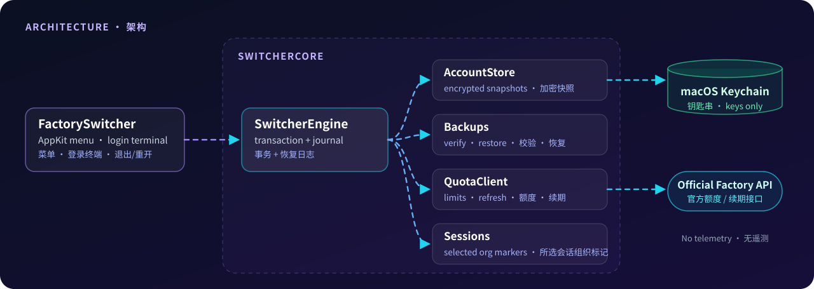

<div align="center">



<p>
  <a href="https://github.com/lhfer/factory-switcher/releases/latest"></a>
  <a href="https://github.com/lhfer/factory-switcher/actions/workflows/ci.yml"></a>
  
  
  
  <a href="LICENSE"></a>
</p>

[English](README.md) · **简体中文**

<h3>工作号、个人号、副业组织号——<br>在菜单栏点一下就切过去。</h3>

<p><a href="#-安装"><b>下载</b></a> · <a href="#-快速上手"><b>快速上手</b></a> · <a href="#-一次切换如何保证安全"><b>工作原理</b></a> · <a href="#-常见问题"><b>常见问题</b></a></p>

</div>

> [!IMPORTANT]
> **这是非官方的社区工具**，与 Factory 官方无关，也未获其认可。它只管理**你自己**通过 Factory 官方登录的账号，**从不自动切号**，不修改服务端额度、账单或组织权限。请按 Factory 服务条款和所属组织规定使用。

## ✨ 为什么做它

如果你用 [Factory](https://factory.ai) Droid 时有不止一个账号，比如公司组织号加个人号，平时切换就得退出登录、重新走一遍浏览器授权，还要担心选错。**Factory 切号器** 为你已经登录过的每个账号保存一份加密快照，从菜单栏一个小小的 `FS` 图标里帮你安全地切换。

<div align="center">
  
</div>

## 🧰 功能一览

| | 功能 | 说明 |
|:-:|---|---|
| 🔁 | **一键切号** | 点选已保存账号 → 正常退出 Factory → 替换登录 → 重新打开 Factory。 |
| 📊 | **额度一目了然** | 每个账号的 5 小时 / 周 / 月**剩余百分比**；接口提供时还会显示重置时间和额外用量余额。默认每 5 分钟刷新，可关闭。 |
| 🔑 | **只走官方登录** | 新账号通过你的 Factory.app 自带的 Droid、在独立目录中登录，浏览器授权全程由官方完成。 |
| 🛡️ | **先备份，失败就回滚** | 每次切换前先建立并校验备份。任何一步失败都会恢复原登录；操作中断后可在菜单中一键恢复。 |
| 🔐 | **加密存储** | 登录快照使用 AES-GCM 加密，密钥存放在 macOS 钥匙串，不和文件放在一起。从不打印或记录令牌。 |
| 💬 | **跨账号继续所选会话**（可选） | 勾选指定的本地对话，切换后在新账号下继续。会先备份，没勾选的对话不会被改动。 |
| 🪶 | **小巧原生** | Swift + AppKit，约 1 MB，零第三方依赖，无遥测，不占 Dock。 |

## 🧭 一次切换如何保证安全

<div align="center">
  
</div>

1. **确认**：弹窗显示目标账号，并提醒正在运行的任务会中断（可在设置中关闭确认）。
2. **正常退出**：请 Factory 正常退出。终端里还有 `droid` 在运行时会拒绝切换，绝不强制结束进程。
3. **备份并校验**：先保存当前账号最新（可能刚轮换过）的令牌，再写入备份并校验。
4. **替换登录**：安装并校验目标账号的加密登录和密钥。
5. **重新打开**：以新账号重新打开 Factory。任何一步失败，都会恢复原登录和会话组织标记。

## 📦 安装

### 方式一：直接下载（Apple Silicon）

1. 从 [**最新 Release**](https://github.com/lhfer/factory-switcher/releases/latest) 下载 `FactorySwitcher-*-arm64.zip` 并解压。
2. 把 `FactorySwitcher.app` 放到固定位置，例如 `~/Applications`。
3. 打开它。构建使用 **ad-hoc 签名、未经 Apple 公证**，首次打开会被 macOS 拦截：前往 **系统设置 → 隐私与安全性**，在页面底部点击 **仍要打开**。
4. 首次使用时 macOS 可能请求钥匙串访问，只对你信任的切号器点允许。

> [!NOTE]
> 请不要通过关闭 Gatekeeper 或移除安全属性来运行。如果不想信任下载的二进制，从源码构建只需要一分钟左右。

### 方式二：从源码构建

需要 macOS 13+ 和 Xcode 16 / Swift 6 命令行工具。

```bash
git clone https://github.com/lhfer/factory-switcher.git
cd factory-switcher
swift test
bash scripts/build-app.sh   # 输出 dist/FactorySwitcher.app
```

## 🚀 快速上手

1. 打开 App，菜单栏右上角出现 **FS**（没有 Dock 图标和主窗口）。
2. 点 **保存 / 同步当前账号**：为当前登录的账号存一份快照，Factory 继续运行、不受影响。
3. 点 **添加账号（官方登录）…**：填个备注，工具会打开终端，在独立目录中运行 Factory 自带的 Droid。在浏览器中完成授权（如果浏览器自动登录了旧账号，把授权链接复制到无痕窗口里打开）。
4. 登录成功后，在那个终端里按 **Ctrl+C** 退出 Droid，**不要**输入 `/logout`。新账号会自动保存。
5. 在菜单中点任一已保存账号即可切换。Factory 重新打开后，先确认显示的邮箱和组织正确，再开始工作。

> [!WARNING]
> **切号会退出并重新打开 Factory，正在运行的任务会中断。** 请先结束或保存工作，并关闭终端中的 `droid` 会话。

完整使用说明见 [`docs/USAGE.zh-CN.md`](docs/USAGE.zh-CN.md)，也可以从菜单 **使用说明…** 打开。

## 🔒 隐私与本机数据

联网只用于你发起的官方登录、官方额度查询，以及闲置账号的官方令牌续期。不接入任何统计或遥测服务，不上传备份。

| 内容 | 位置 |
|---|---|
| 账号备注、邮箱、用户 / 组织标识、偏好 | `~/.factory-switcher/state.json` |
| 加密登录快照 | `~/.factory-switcher/accounts/` |
| 登录备份、所选会话副本、恢复记录 | `~/.factory-switcher/backups/` |
| 官方登录使用的独立目录 | `~/.factory-switcher/logins/` |
| 快照与备份的加密密钥 | macOS 钥匙串，服务名 `local.FactorySwitcher.keys` |

敏感目录权限为 `0700`，文件为 `0600`。**会话备份包含完整对话正文，没有另行加密**；备注和邮箱也是明文元数据，都依靠文件权限保护。建议开启 FileVault，不要把 `~/.factory-switcher` 放进云同步目录。

## ❓ 常见问题

<details>
<summary><b>能用它多拿额度、绕过限制吗？</b></summary>

不能。它只显示你自己各个账号的官方额度，由你手动切换；不会自动切号、不会创建账号，也不会修改额度、账单或组织设置。请只在 Factory 条款和所属组织允许的范围内使用多个账号。
</details>

<details>
<summary><b>添加新账号时，浏览器自动登录了旧账号？</b></summary>

这是浏览器里已有的登录状态，跟切号器无关。把 Droid 给出的授权链接复制到无痕窗口，再登录你想添加的账号。
</details>

<details>
<summary><b>切换时正在跑的代理会保留吗？</b></summary>

不会。切换会退出并重新打开 Factory。终端里有 `droid` 进程时工具会拒绝切换，也绝不强制结束进程，但 Factory 内部正在运行的任务会停止。
</details>

<details>
<summary><b>能把 A 账号的对话拿到 B 账号继续吗？</b></summary>

只能处理你主动勾选的对话。工具会先备份，再移除这些对话首行的组织标记，让 Droid 能在新账号下打开。**继续这些对话时，内容可能被发送到新账号所属的组织**，不要把公司机密对话带到个人账号。可以在 **备份与恢复** 中还原原来的组织标记。
</details>

<details>
<summary><b>支持 Intel Mac 或更旧的 macOS 吗？</b></summary>

目前只在 Apple Silicon、macOS 13+ 上构建和测试。Intel 和旧系统未经验证，在 Intel 上从源码构建也许可行，但没有测试过。
</details>

<details>
<summary><b>如何彻底卸载？</b></summary>

先退出切号器和登录终端，把 `~/.factory-switcher` 移到废纸篓，再在“钥匙串访问”中删除服务名为`local.FactorySwitcher.keys` 的项目。这样会失去切号器的全部备份。**不要删除 `~/.factory`、你的 Factory 会话或 `Factory CLI` 钥匙串项目。**
</details>

## 🏗️ 实现概览

<div align="center">
  
</div>

- **43 项 XCTest**，全部使用模拟 JWT、内存钥匙串、假进程 / 网络层和临时目录。覆盖 AES-GCM 互通、文件权限 / 锁 / 符号链接、每个失败点的回滚、崩溃恢复、令牌轮换和选择性会话共享，测试从不接触真实账号。详见 [`VALIDATION.md`](VALIDATION.md)。
- 兼容开发时的 Factory.app 0.187 / Droid 0.230 存储格式。将来遇到不认识的格式会直接停止，不会猜测处理。

## 🙏 致谢

官方登录隔离方式和本地格式处理参考了 shariqriazz 的[**droid-switcher**](https://github.com/shariqriazz/droid-switcher)（MIT）。本项目是独立的 Swift/AppKit 实现，不包含该项目的代码或二进制，详见[`THIRD_PARTY_NOTICES.md`](THIRD_PARTY_NOTICES.md)。

## 📄 许可证

[MIT](LICENSE) © 2026 lhfer。“Factory”和“Droid”归其各自所有者所有。

<div align="center">
<br>
<sub>如果它每天帮你省下几次重新登录，点个 ⭐ 能让更多 Factory 用户找到它。</sub>
<br><br>
<a href="https://star-history.com/#lhfer/factory-switcher&Date"></a>
</div>
